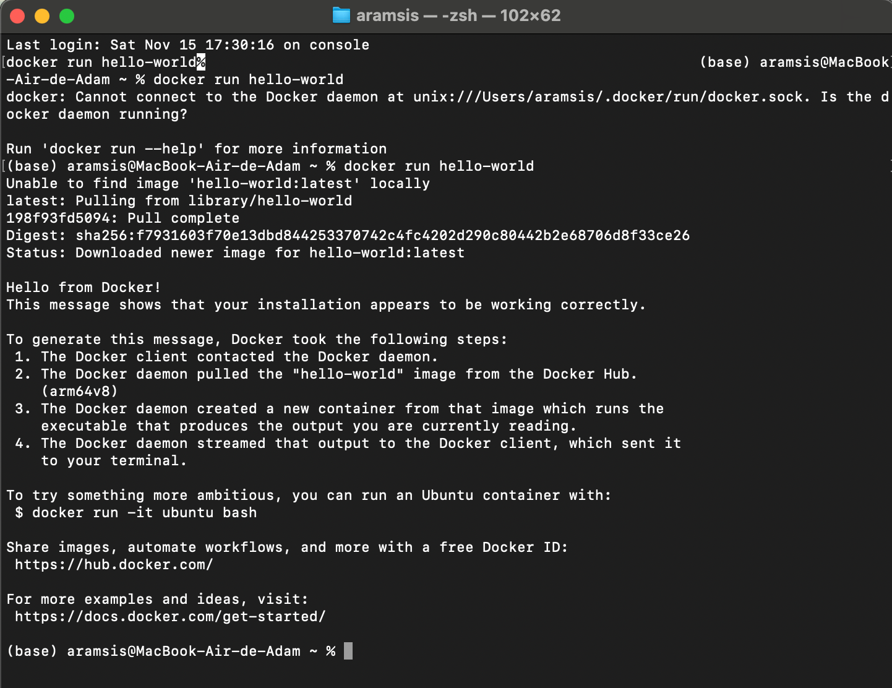

# Rapport TP1 : Fondamentaux du MLOps et Docker

**Auteur :** Adam Ramsis

## Exercice 1 

### Question 1.b
*Capture d'écran de l'exécution de `docker run hello-world` :*


### Question 1.c
La commande `docker ps -a` permet de lister tous les conteneurs, qu'ils soient en cours d'exécution ou arrêtés.
Dans mon cas, la liste montre le conteneur `hello-world` avec le statut `Exited (0)`. Cela indique que le conteneur a terminé son exécution correctement (code de sortie 0) et n'est plus actif.

## Exercice 2 

### Question 2.a : Différence entre image et conteneur
* **Image :** Une image est un modèle immuable qui contient tout le nécessaire pour exécuter une application (code, bibliothèques, dépendances...). C'est comparable à une classe en programmation orientée objet.
* **Conteneur :** Un conteneur est une instance active d'une image. C'est un processus isolé avec son propre système de fichiers. C'est comparable à un objet instancié.

### Question 2.b : Exécution d'Alpine
Lors de l'exécution de la commande `docker run alpine echo "Bonjour depuis un conteneur Alpine"` :
1.  Docker a téléchargé l'image `alpine` car elle n'était pas présente localement ("Unable to find image...").
2.  Il a créé un conteneur et exécuté la commande `echo`.
3.  Une fois le message affiché, le processus s'est terminé et le conteneur s'est arrêté immédiatement.

### Question 2.c : Statut Exited
Le conteneur apparaît avec le statut `Exited` car un conteneur Docker s'arrête dès que son processus principal (ici la commande `echo`) se termine. Comme l'affichage du message est instantané, le conteneur ne reste pas actif.

### Question 2.d : Mode interactif
En executant
`ls
uname -a
exit`
dans le terminale j'observe :
* Une structure de fichiers Linux standard (`/bin`, `/etc`, `/usr`), différente de celle de mon Mac.
* Le noyau indiqué est un noyau Linux (LinuxKit), ce qui prouve l'isolation par rapport à mon système d'exploitation hôte (macOS) .

## Exercice 3

### Question 3.a : Code de l'application
Voici le code complété du fichier `app.py` :

```python
from fastapi import FastAPI
import uvicorn

app = FastAPI()

@app.get("/health")
def health():
    return {"status": "ok"}
```

### Question 3.b

```dockerfile
# Dockerfile

# TODO: choisir une image de base Python
FROM python:3.9

# TODO: définir le répertoire de travail dans le conteneur
WORKDIR /app
# TODO: copier le fichier app.py
COPY ../api/app.py .
# Installer FastAPI et Uvicorn
RUN pip install fastapi uvicorn

# TODO: lancer le serveur au démarrage du conteneur
CMD ["uvicorn", "app:app", "--host", "0.0.0.0", "--port", "8000"]
```

### Question 3.c

Docker build succeed 

Terminal output:
```terminaloutput
(.venv) (base) aramsis@MacBook-Air-de-Adam CSC8613-TP1 % docker build -t simple-api .
[+] Building 46.3s (9/9) FINISHED                                                                                                                         docker:desktop-linux
=> [internal] load build definition from Dockerfile                                                                                                                      0.0s
=> => transferring dockerfile: 414B                                                                                                                                      0.0s
=> [internal] load metadata for docker.io/library/python:3.9                                                                                                             1.6s
=> [internal] load .dockerignore                                                                                                                                         0.0s
=> => transferring context: 2B                                                                                                                                           0.0s
=> [1/4] FROM docker.io/library/python:3.9@sha256:da5aee29682d12a6649f51c8d6f15b87deb3e6c524b923c41d0cb3304d07c913                                                      39.4s
=> => resolve docker.io/library/python:3.9@sha256:da5aee29682d12a6649f51c8d6f15b87deb3e6c524b923c41d0cb3304d07c913                                                       0.0s
=> => sha256:e2f695ddffd81064f15ea19428e2d643e8b560e48e54ae801a8d63c45ad6ac29 226.08MB / 226.08MB                                                                       36.6s
=> => sha256:340596e2073b9c98b85e055c27ed40e681738de27a70821df1779ef56b1b13c6 6.20MB / 6.20MB                                                                            2.7s
=> => sha256:d23b9a9db1c084766db25b551c13cb1608bc5daaee1dfda53dc4c1af47538e88 250B / 250B                                                                                0.2s
=> => sha256:f488e967fa204f7e8f106ac0aa9b403d7e11aaf65dfc679a1cab0a3771407329 19.87MB / 19.87MB                                                                          5.2s
=> => sha256:721433549fef8bfa398445abce4a12b5c7e64775b3de57bfc3ff37c8ed6fc0e4 67.58MB / 67.58MB                                                                         14.6s
=> => sha256:f510ac7d6fe76c0362c0162daee6964c5b93b20f5ddf65021b0bf3bcce16f306 25.02MB / 25.02MB                                                                          9.0s
=> => sha256:2a101b2fcb53d61db540cb76da094137d4f0291a93fa41357ab70c3debf4d3c3 49.65MB / 49.65MB                                                                         17.1s
=> => extracting sha256:2a101b2fcb53d61db540cb76da094137d4f0291a93fa41357ab70c3debf4d3c3                                                                                 0.5s
=> => extracting sha256:f510ac7d6fe76c0362c0162daee6964c5b93b20f5ddf65021b0bf3bcce16f306                                                                                 0.2s
=> => extracting sha256:721433549fef8bfa398445abce4a12b5c7e64775b3de57bfc3ff37c8ed6fc0e4                                                                                 0.7s
=> => extracting sha256:e2f695ddffd81064f15ea19428e2d643e8b560e48e54ae801a8d63c45ad6ac29                                                                                 2.4s
=> => extracting sha256:340596e2073b9c98b85e055c27ed40e681738de27a70821df1779ef56b1b13c6                                                                                 0.1s
=> => extracting sha256:f488e967fa204f7e8f106ac0aa9b403d7e11aaf65dfc679a1cab0a3771407329                                                                                 0.2s
=> => extracting sha256:d23b9a9db1c084766db25b551c13cb1608bc5daaee1dfda53dc4c1af47538e88                                                                                 0.0s
=> [internal] load build context                                                                                                                                         0.0s
=> => transferring context: 141B                                                                                                                                         0.0s
=> [2/4] WORKDIR /app                                                                                                                                                    0.7s
=> [3/4] COPY app.py .                                                                                                                                                   0.0s
=> [4/4] RUN pip install fastapi uvicorn                                                                                                                                 3.9s
=> exporting to image                                                                                                                                                    0.7s
=> => exporting layers                                                                                                                                                   0.5s
=> => exporting manifest sha256:eb78db069febf54dffd7e98d8c54c472b06c6755bb3116c5465ee015ed137458                                                                         0.0s
=> => exporting config sha256:2607e54a444fea01ba027b228fe820d729ce8eee722a4a273d126e953e05c92a                                                                           0.0s
=> => exporting attestation manifest sha256:08f6043c2d400d7ba37ea1766fc2c0b68c2adcbf8db82aadabb1e02e2ce67c73                                                             0.0s
=> => exporting manifest list sha256:852bed1fbf277f950f42a41104a783485587f6d7a1c42eea4fb8116f5b02fd9d                                                                    0.0s
=> => naming to docker.io/library/simple-api:latest                                                                                                                      0.0s
=> => unpacking to docker.io/library/simple-api:latest                                                                                                                   0.1s
```

## Exercice 4

### Question 4.a

Terminal output:
```terminaloutput
(.venv) (base) aramsis@MacBook-Air-de-Adam CSC8613-TP1 % docker run -p 8000:8000 simple-api
INFO:     Started server process [1]
INFO:     Waiting for application startup.
INFO:     Application startup complete.
INFO:     Uvicorn running on http://0.0.0.0:8000 (Press CTRL+C to quit)
```
Rôle de l'option -p 8000:8000 :
Cette option effectue une redirection de port. Elle relie le port 8000 de la machine hôte (mon ordinateur) au port 8000 à l'intérieur du conteneur. Sans cela, l'API tournerait bien dans le conteneur, mais serait inaccessible depuis l'extérieur (mon navigateur ou terminal).

### Question 4.b
La commande curl http://localhost:8000/health a renvoyé la réponse JSON attendue.

Terminal output:

```terminaloutput
(.venv) (base) aramsis@MacBook-Air-de-Adam CSC8613-TP1 % curl http://localhost:8000/health
{"status":"ok"}
```


### Question 4.c

Terminal output:

```terminaloutput
(.venv) (base) aramsis@MacBook-Air-de-Adam CSC8613-TP1 % docker ps
CONTAINER ID   IMAGE        COMMAND                  CREATED         STATUS         PORTS                                         NAMES
c4a37f856bf3   simple-api   "uvicorn app:app --h…"   2 minutes ago   Up 2 minutes   0.0.0.0:8000->8000/tcp, [::]:8000->8000/tcp   dazzling_wright
```

D'après la sortie de la commande docker ps, voici les informations du conteneur actif :

Nom du conteneur : dazzling_wright.

Image utilisée : simple-api.

Port mappé : 0.0.0.0:8000->8000/tcp (Le port 8000 local redirige vers le 8000 du conteneur).

### Question 4.d

Terminal output :

```terminaloutput
(.venv) (base) aramsis@MacBook-Air-de-Adam CSC8613-TP1 % docker stop c4a37f856bf3            
c4a37f856bf3
(.venv) (base) aramsis@MacBook-Air-de-Adam CSC8613-TP1 % docker ps
CONTAINER ID   IMAGE     COMMAND   CREATED   STATUS    PORTS     NAMES
(.venv) (base) aramsis@MacBook-Air-de-Adam CSC8613-TP1 % docker ps -a
CONTAINER ID   IMAGE         COMMAND                  CREATED          STATUS                      PORTS     NAMES
c4a37f856bf3   simple-api    "uvicorn app:app --h…"   5 minutes ago    Exited (0) 44 seconds ago             dazzling_wright
53e005240d80   alpine        "sh"                     26 minutes ago   Exited (0) 26 minutes ago             eloquent_greider
300b86af65ad   alpine        "echo 'Bonjour depui…"   26 minutes ago   Exited (0) 26 minutes ago             gallant_albattani
faa2b8a696ed   hello-world   "/hello"                 44 minutes ago   Exited (0) 44 minutes ago             vibrant_lamarr
```

Après avoir arrêté le conteneur avec docker stop, celui-ci n'apparaît plus dans docker ps mais reste visible dans docker ps -a avec le statut Exited (0).

Différence entre les commandes :

docker ps : Liste uniquement les conteneurs en cours d'exécution (actifs).

docker ps -a : Liste tous les conteneurs, y compris ceux qui sont arrêtés ou qui ont terminé leur exécution (historique).


## Question 5 

### Question 5.b

Dans docker-compose.yml
```yml
version: "3.9"

services:
  db:
    image: postgres:16
    environment:
      # TODO: définir l'utilisateur, le mot de passe et le nom de la base
      POSTGRES_USER: tp1
      POSTGRES_PASSWORD: tp1
      POSTGRES_DB: tp1
    ports:
      # TODO: exposer le port PostgreSQL vers l'hôte
      - "5432:5432"

  api:
    # TODO: construire l'image à partir du Dockerfile dans ./api
    build: ./api
    ports:
      # TODO: exposer le port 8000 du conteneur vers l'hôte
      - "8000:8000"
    depends_on:
      # TODO: indiquer que l'API dépend de la base de données
      - db
```
### Question 5.c

La commande docker compose up -d a permis de lancer l'ensemble des services définis.
Les logs indiquent que :

Le réseau csc8613-tp1_default a été créé.

L'image de l'API a été construite.

Les conteneurs csc8613-tp1-db-1 (base de données) et csc8613-tp1-api-1 (API) ont démarré.

La commande docker compose ps confirme que les deux services sont actifs (Up) avec les ports correctement exposés :

API : 0.0.0.0:8000->8000/tcp

DB : 0.0.0.0:5432->5432/tcp


Terminal output : 
```terminaloutput
(.venv) (base) aramsis@MacBook-Air-de-Adam CSC8613-TP1 % docker compose up -d
WARN[0000] /Users/aramsis/IdeaProjects/CSC8613-TP1/docker-compose.yml: the attribute `version` is obsolete, it will be ignored, please remove it to avoid potential confusion 
[+] Running 15/15
 ✔ db Pulled                                                                                                                                                             14.3s 
[+] Building 1.0s (11/11) FINISHED                                                                                                                                             
 => [internal] load local bake definitions                                                                                                                                0.0s
 => => reading from stdin 535B                                                                                                                                            0.0s
 => [internal] load build definition from Dockerfile                                                                                                                      0.0s
 => => transferring dockerfile: 413B                                                                                                                                      0.0s
 => [internal] load metadata for docker.io/library/python:3.9                                                                                                             0.8s
 => [internal] load .dockerignore                                                                                                                                         0.0s
 => => transferring context: 2B                                                                                                                                           0.0s
 => [1/4] FROM docker.io/library/python:3.9@sha256:da5aee29682d12a6649f51c8d6f15b87deb3e6c524b923c41d0cb3304d07c913                                                       0.0s
 => => resolve docker.io/library/python:3.9@sha256:da5aee29682d12a6649f51c8d6f15b87deb3e6c524b923c41d0cb3304d07c913                                                       0.0s 
 => [internal] load build context                                                                                                                                         0.0s 
 => => transferring context: 141B                                                                                                                                         0.0s 
 => CACHED [2/4] WORKDIR /app                                                                                                                                             0.0s
 => CACHED [3/4] COPY app.py .                                                                                                                                            0.0s 
 => CACHED [4/4] RUN pip install fastapi uvicorn                                                                                                                          0.0s 
 => exporting to image                                                                                                                                                    0.0s 
 => => exporting layers                                                                                                                                                   0.0s 
 => => exporting manifest sha256:d771e5cfbd1f8a53436aa9a782db2e1522f7806d0750915ffb872e94df5c1082                                                                         0.0s 
 => => exporting config sha256:450f556d8ebca17f70a3d4f709cb21d0d25176aa6117690d069e97e68af58e4e                                                                           0.0s 
 => => exporting attestation manifest sha256:84adf1643baed247f39d8ebd7b039ed8e25ad2642f61439620f976df04f719cf                                                             0.0s 
 => => exporting manifest list sha256:07fe5bef2811af15d9f3fe47722fdd99ca10308fb8db548ce783151ae376b3c8                                                                    0.0s 
 => => naming to docker.io/library/csc8613-tp1-api:latest                                                                                                                 0.0s 
 => => unpacking to docker.io/library/csc8613-tp1-api:latest                                                                                                              0.0s 
 => resolving provenance for metadata file                                                                                                                                0.0s 
[+] Running 4/4                                                                                                                                                                
 ✔ csc8613-tp1-api              Built                                                                                                                                     0.0s 
 ✔ Network csc8613-tp1_default  Created                                                                                                                                   0.0s 
 ✔ Container csc8613-tp1-db-1   Started                                                                                                                                   0.6s 
 ✔ Container csc8613-tp1-api-1  Started                                                                                                                                   0.3s 
(.venv) (base) aramsis@MacBook-Air-de-Adam CSC8613-TP1 % docker compose ps
WARN[0000] /Users/aramsis/IdeaProjects/CSC8613-TP1/docker-compose.yml: the attribute `version` is obsolete, it will be ignored, please remove it to avoid potential confusion 
NAME                IMAGE             COMMAND                  SERVICE   CREATED          STATUS          PORTS
csc8613-tp1-api-1   csc8613-tp1-api   "uvicorn app:app --h…"   api       25 seconds ago   Up 24 seconds   0.0.0.0:8000->8000/tcp, [::]:8000->8000/tcp
csc8613-tp1-db-1    postgres:16       "docker-entrypoint.s…"   db        25 seconds ago   Up 24 seconds   0.0.0.0:5432->5432/tcp, [::]:5432->5432/tcp
```


### Question 5.d

Terminal output :
```terminaloutput
(.venv) (base) aramsis@MacBook-Air-de-Adam CSC8613-TP1 % curl http://localhost:8000/health
{"status":"ok"}
```
Le test de l'endpoint via curl http://localhost:8000/health retourne bien {"status":"ok"}. Cela prouve que l'API est correctement accessible depuis ma machine, même en étant orchestrée par Docker Compose avec une dépendance réseau vers la base de données.

### Question 5.e

Terminal output :
```terminaloutput
(.venv) (base) aramsis@MacBook-Air-de-Adam CSC8613-TP1 % docker compose down
WARN[0000] /Users/aramsis/IdeaProjects/CSC8613-TP1/docker-compose.yml: the attribute `version` is obsolete, it will be ignored, please remove it to avoid potential confusion 
[+] Running 3/3
 ✔ Container csc8613-tp1-api-1  Removed                                                                                                                                   0.4s 
 ✔ Container csc8613-tp1-db-1   Removed                                                                                                                                   0.1s 
 ✔ Network csc8613-tp1_default  Removed    
```

La commande docker compose down arrête et supprime les conteneurs ainsi que le réseau associé.

Différence entre stop et compose :

- docker stop : Arrête simplement le processus du conteneur. Le conteneur existe toujours (visible avec ps -a) et peut être redémarré. Le réseau n'est pas supprimé.
- docker compose down : Arrête les services, supprime les conteneurs et supprime le réseau virtuel créé par Docker Compose. C'est une commande de nettoyage complet de l'environnement, idéale pour repartir de zéro.


## Exercice 6

### Question 6.a


```terminaloutput
(.venv) (base) aramsis@MacBook-Air-de-Adam CSC8613-TP1 % docker compose exec db psql -U tp1 -d tp1  
WARN[0000] /Users/aramsis/IdeaProjects/CSC8613-TP1/docker-compose.yml: the attribute `version` is obsolete, it will be ignored, please remove it to avoid potential confusion 
psql (16.11 (Debian 16.11-1.pgdg13+1))
Type "help" for help.

tp1=#
```

Explication des options de la commande :

exec db : Demande à Docker Compose d'exécuter une commande à l'intérieur du conteneur associé au service nommé db.

psql : C'est le programme client en ligne de commande pour PostgreSQL que l'on souhaite lancer.

-U tp1 : L'option -U (User) spécifie l'utilisateur de base de données à utiliser pour la connexion (ici tp1).

-d tp1 : L'option -d (Database) indique le nom de la base de données spécifique à laquelle se connecter (ici tp1).


### Question 6.b

Suite à l'exécution des commandes SQL dans le shell interactif, voici les observations :

SELECT version(); : La base de données utilise la version PostgreSQL 16.11.

SELECT current_database(); : La base de données active est bien tp1.

```terminaloutput
tp1=# SELECT version();
                                                          version                                                           
----------------------------------------------------------------------------------------------------------------------------
 PostgreSQL 16.11 (Debian 16.11-1.pgdg13+1) on aarch64-unknown-linux-gnu, compiled by gcc (Debian 14.2.0-19) 14.2.0, 64-bit
(1 row)

tp1=# SELECT current_database();
 current_database 
------------------
 tp1
(1 row)

tp1=# exit
```
### Question 6.c

Pour qu'un autre service du même réseau Docker (comme notre API FastAPI) puisse se connecter à cette base de données, il doit utiliser les paramètres de connexion internes suivants :

Hostname (Hôte) : db

Explication : Docker Compose configure un DNS interne qui permet aux services de communiquer en utilisant leur nom de service comme nom d'hôte.

Port : 5432

Explication : C'est le port par défaut de PostgreSQL à l'intérieur du réseau Docker.

Utilisateur et Mot de passe : tp1 (et le mot de passe défini dans le docker-compose.yml, probablement tp1 vu le contexte).

Nom de la base : tp1


### Question 6.d

Après avoir arrêté les services avec docker compose down, la commande docker compose down -v a été exécutée.

Conséquence de l'option -v :
Cette option demande à Docker de supprimer également les volumes nommés déclarés dans la section volumes du fichier docker-compose.yml.
Concrètement, cela détruit de manière permanente toutes les données persistantes de la base de données. Sans cette option, les données seraient conservées sur le disque et restaurées au prochain démarrage (docker compose up).


```terminaloutput
(.venv) (base) aramsis@MacBook-Air-de-Adam CSC8613-TP1 % docker compose down
WARN[0000] /Users/aramsis/IdeaProjects/CSC8613-TP1/docker-compose.yml: the attribute `version` is obsolete, it will be ignored, please remove it to avoid potential confusion 
[+] Running 3/3
 ✔ Container csc8613-tp1-api-1  Removed                                                                                                                                   0.3s 
 ✔ Container csc8613-tp1-db-1   Removed                                                                                                                                   0.1s 
 ✔ Network csc8613-tp1_default  Removed                                                                                                                                   0.1s 
(.venv) (base) aramsis@MacBook-Air-de-Adam CSC8613-TP1 % docker compose down -v
WARN[0000] /Users/aramsis/IdeaProjects/CSC8613-TP1/docker-compose.yml: the attribute `version` is obsolete, it will be ignored, please remove it to avoid potential confusion 
```


## Exercice 7 

### Question 7.a

La commande docker compose logs -f api permet de suivre l'activité du service en temps réel.
Observations :

Au démarrage, on voit les logs d'initialisation d'Uvicorn : Application startup complete.

Lorsqu'on appelle l'endpoint /health, une nouvelle ligne apparaît : "GET /health HTTP/1.1" 200 OK. Cela confirme que la requête a bien été reçue et traitée par le serveur avec un code de succès (200).


Logs lorsque l'api démarre correctement et qu'on recoit une requete /health:
```terminaloutput
(.venv) (base) aramsis@MacBook-Air-de-Adam CSC8613-TP1 % docker compose up -d
WARN[0000] /Users/aramsis/IdeaProjects/CSC8613-TP1/docker-compose.yml: the attribute `version` is obsolete, it will be ignored, please remove it to avoid potential confusion
[+] Running 3/3
✔ Network csc8613-tp1_default  Created                                                                                                                                   0.0s
✔ Container csc8613-tp1-db-1   Started                                                                                                                                   0.2s
✔ Container csc8613-tp1-api-1  Started                                                                                                                                   0.2s
(.venv) (base) aramsis@MacBook-Air-de-Adam CSC8613-TP1 % curl http://localhost:8000/health
{"status":"ok"}%                                                                                                                                                               (.venv) (base) aramsis@MacBook-Air-de-Adam CSC8613-TP1 % docker compose logs -f api       
WARN[0000] /Users/aramsis/IdeaProjects/CSC8613-TP1/docker-compose.yml: the attribute `version` is obsolete, it will be ignored, please remove it to avoid potential confusion
api-1  | INFO:     Started server process [1]
api-1  | INFO:     Waiting for application startup.
api-1  | INFO:     Application startup complete.
api-1  | INFO:     Uvicorn running on http://0.0.0.0:8000 (Press CTRL+C to quit)
api-1  | INFO:     192.168.65.1:50593 - "GET /health HTTP/1.1" 200 OK
```

### Question 7.b

En entrant dans le conteneur avec `docker compose exec api sh` :

La commande ls montre la présence du fichier app.py (copié via le Dockerfile).

La commande python --version indique que l'environnement utilise Python 3.9.25.


```terminaloutput
(.venv) (base) aramsis@MacBook-Air-de-Adam CSC8613-TP1 % docker compose exec api sh
WARN[0000] /Users/aramsis/IdeaProjects/CSC8613-TP1/docker-compose.yml: the attribute `version` is obsolete, it will be ignored, please remove it to avoid potential confusion
# ls
__pycache__  app.py
# python --version
Python 3.9.25
# exit
```

### Question 7.c

Le redémarrage du service avec docker compose restart api a été effectué avec succès et l'API est de nouveau accessible immédiatement.

Utilité du redémarrage :
Cette opération est utile pour :

- Relancer un service qui a planté ou qui ne répond plus.
- Appliquer des changements de configuration.
- Libérer des ressources (mémoire) en cas de fuite, sans avoir à reconstruire l'image ou redémarrer toute la stack.


```terminaloutput
(.venv) (base) aramsis@MacBook-Air-de-Adam CSC8613-TP1 % docker compose exec api sh
WARN[0000] /Users/aramsis/IdeaProjects/CSC8613-TP1/docker-compose.yml: the attribute `version` is obsolete, it will be ignored, please remove it to avoid potential confusion 
# ls
__pycache__  app.py
# python --version
Python 3.9.25
# exit
(.venv) (base) aramsis@MacBook-Air-de-Adam CSC8613-TP1 % docker compose restart api
WARN[0000] /Users/aramsis/IdeaProjects/CSC8613-TP1/docker-compose.yml: the attribute `version` is obsolete, it will be ignored, please remove it to avoid potential confusion 
[+] Restarting 1/1
 ✔ Container csc8613-tp1-api-1  Started                                                                                                                                   0.4s 
(.venv) (base) aramsis@MacBook-Air-de-Adam CSC8613-TP1 % curl http://localhost:8000/health
{"status":"ok"}%     
```

### Question 7.d

Après avoir modifié le code pour renommer l'instance app en appi, le build et le démarrage apparent (up -d) ont réussi. Cependant, le service ne fonctionne pas.

#### Analyse des logs :
La commande docker compose logs -f api révèle un crash de l'application Python avec l'erreur suivante :

```terminaloutput
NameError: name 'app' is not defined
```

Explication :
L'erreur se produit lors de l'exécution du script Python. J'ai défini appi = FastAPI() mais j'ai laissé le décorateur @app.get(...) dans le code. Comme la variable app n'existe plus (elle s'appelle appi), Python lève une NameError et le programme s'arrête immédiatement.
Même si le code était corrigé (@appi.get), Uvicorn échouerait ensuite car la commande CMD cherche toujours l'objet app ("app:app").


### Question 7.e

Pourquoi est-il utile de nettoyer régulièrement son environnement Docker ?

- Optimisation de l'espace disque : les images Docker sont constituées de superpositions de couches. À force de reconstruire des images (comme lors du débogage à la question précédente), les anciennes couches et les images "orphelines" s'accumulent et peuvent rapidement saturer l'espace disque de la machine.

- Éviter les conflits de noms : Les conteneurs, même arrêtés, conservent leur nom. Si on utilise des noms explicites (comme api ou db), on ne peut pas créer un nouveau conteneur avec le même nom tant que l'ancien n'est pas supprimé. Le nettoyage prévient ces erreurs.

- Lisibilité : La commande docker ps -a affiche tout l'historique. Nettoyer les vieux conteneurs permet de garder une vue claire sur l'état actuel du système et facilite le diagnostic en ne montrant que les processus pertinents.

## Exercice 8 

### Question 8.a 

Bien que très utiles pour l'exploration, les notebooks Jupyter ne sont pas adaptés au déploiement d'un modèle en production pour plusieurs raisons fondamentales :

- Problème de reproductibilité et d'environnement : Un notebook s'exécute généralement dans l'environnement local de la machine, qui peut varier d'un développeur à l'autre (versions de bibliothèques différentes, OS différent). Contrairement à l'approche conteneurisée, qui fige strictement les dépendances dans une image Docker, un notebook ne garantit pas que le code fonctionnera de la même manière ailleurs.

- Manque d'automatisation et états cachés : Un système de Machine Learning en production doit être un pipeline logiciel automatisable (ingestion, entraînement, déploiement). Les notebooks favorisent une exécution manuelle et non linéaire (ordre des cellules), ce qui peut créer des "états cachés" en mémoire impossibles à reproduire automatiquement. Ils s'intègrent donc mal dans des orchestrateurs comme Docker Compose.

### Question 8.b 

Docker Compose s'avère être un outil essentiel dès lors que l'architecture dépasse un seul conteneur, et ce pour deux raisons principales observées durant le TP :

- Orchestration centralisée : Plutôt que de lancer chaque service (API, Base de données) manuellement avec des commandes docker run complexes et sujettes à erreurs, Docker Compose nous permet de définir toute l'infrastructure dans un seul fichier. Une unique commande `docker compose up` suffit alors pour démarrer l'ensemble du système de manière cohérente.

- Gestion simplifiée du réseau : Comme nous l'avons vu lors de la connexion à la base de données, Docker Compose crée automatiquement un réseau virtuel pour l'application. Cela permet aux différents services de communiquer entre eux simplement en utilisant leur nom de service (comme db) comme nom d'hôte, sans avoir à gérer manuellement les adresses IP.