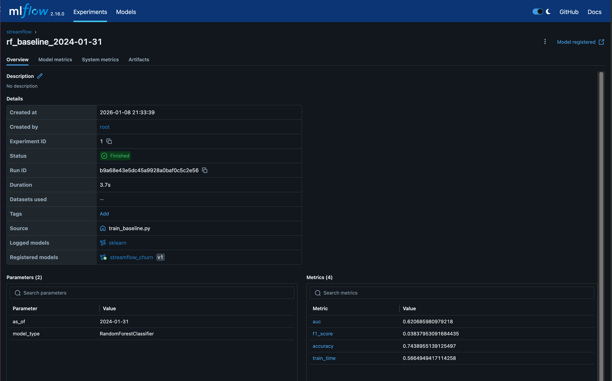
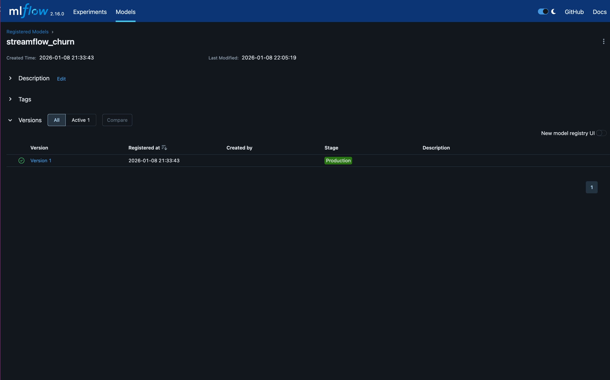

# Exercice 1

### Commandes et Vérifications

**Démarrage de la stack :**

J'ai ajouté le service `mlflow` au fichier `docker-compose.yml` et lancé la commande :
```bash
docker compose up -d
```
**État des services :**

```terminaloutput
(.venv) (base) aramsis@mac csc8613-tp1 % docker compose ps
NAME                     IMAGE                 COMMAND                  SERVICE    CREATED       STATUS       PORTS
csc8613-tp1-api-1        csc8613-tp1-api       "uvicorn app:app --h…"   api        4 hours ago   Up 4 hours   0.0.0.0:8000->8000/tcp, [::]:8000->8000/tcp
csc8613-tp1-feast-1      csc8613-tp1-feast     "bash -lc 'tail -f /…"   feast      4 hours ago   Up 4 hours   
csc8613-tp1-postgres-1   postgres:16           "docker-entrypoint.s…"   postgres   5 hours ago   Up 5 hours   0.0.0.0:5432->5432/tcp, [::]:5432->5432/tcp
csc8613-tp1-prefect-1    csc8613-tp1-prefect   "/usr/bin/tini -g --…"   prefect    4 hours ago   Up 4 hours   
```


**Preuve d'accessibilité :**

- MLflow UI (Port 5000) :
```terminaloutput
(.venv) (base) aramsis@mac csc8613-tp1 % curl -I http://localhost:5000
HTTP/1.1 403 Forbidden
Content-Length: 0
Server: AirTunes/870.14.1
X-Apple-ProcessingTime: 0
X-Apple-RequestReceivedTimestamp: 194571326
```
- API Health (Port 8000) : 
```terminaloutput
(.venv) (base) aramsis@mac csc8613-tp1 % curl http://localhost:8000/health
{"status":"ok"}%                                          
```
- Feast online feature :
```terminaloutput
(.venv) (base) aramsis@mac csc8613-tp1 % curl http://localhost:8000/features/7590-VHVEG
{"user_id":"7590-VHVEG","features":{"user_id":"7590-VHVEG","months_active":1,"monthly_fee":29.850000381469727,"paperless_billing":true}}%            
```

**Composants de l'architecture**

Voici les composants qui tournent actuellement et leur rôle :

- PostgreSQL : Base de données centrale (stockage des tables live, snapshots, feature store registry et métadonnées MLflow).

- Prefect : Orchestrateur pour l'ingestion et bientôt le pipeline d'entraînement.

- Feast : Feature Store assurant la cohérence des données entre l'entraînement (offline) et l'inférence (online).

- MLflow : Serveur de tracking pour enregistrer les expériences (paramètres, métriques) et Model Registry pour versionner les modèles.

- API (FastAPI) : Service exposant les prédictions en temps réel.
---

# Exercice 2 


**Commande lancée :**

```bash
docker compose exec -e TRAIN_AS_OF=2024-01-31 prefect python /opt/prefect/flows/train_baseline.py
```
**Output :**

```terminaloutput
Successfully registered model 'streamflow_churn'.
2026/01/08 20:33:43 INFO mlflow.store.model_registry.abstract_store: Waiting up to 300 seconds for model version to finish creation. Model name: streamflow_churn, version 1
Created version '1' of model 'streamflow_churn'.
[OK] Trained baseline RF. AUC=0.6207 F1=0.0384 ACC=0.7439 (run_id=b9a68e43e5dc45a9928a0baf0c5c2e56)
2026/01/08 20:33:43 INFO mlflow.tracking._tracking_service.client: 🏃 View run rf_baseline_2024-01-31 at: http://mlflow:5000/#/experiments/1/runs/b9a68e43e5dc45a9928a0baf0c5c2e56.
2026/01/08 20:33:43 INFO mlflow.tracking._tracking_service.client: 🧪 View experiment at: http://mlflow:5000/#/experiments/1.
```
Screenshot MLFlow UI sur localhost:5000:


## Question 2.C 

1. Valeur de **AS_OF** : 2024-01-31
2. Nombre de lignes du dataset d’entraînement (après merge) : 7043 
3. les colonnes catégorielles détectées (cat_cols) : `['net_service']`, visible dans mlartifacts/artifacts/1/b9a68e43e5dc45a9928a0baf0c5c2e56/artifacts/feature_schema.json`
4. Métriques :

    AUC : 0.6207

    F1 : 0.0384

    Accuracy : 0.7439

    Temps d'entrainement : 0.57 secondes

## Question 2.d

Dans une pipeline MLOps, la reproductibilité est assurée par deux paramètres clés figés dans ce script :

- AS_OF : Ce paramètre garantit la "Point-in-Time Correctness". 
En fixant la date, nous forçons le Feature Store à reconstruire le dataset exactement tel qu'il était à ce moment précis du passé, sans fuite de données futures. Cela permet de ré-entrainer un modèle sur des données historiques inchangées, même si la base de données a évolué depuis. 
- random_state : Les algorithmes comme le Random Forest ou les divisions train/test comportent une part d'aléatoire. Fixer une seed assure que pour les mêmes données en entrée, l'algorithme produira toujours exactement le même modèle et les mêmes scores. C'est nécessaire pour comparer sainement deux versions de code sans que le hasard ne fausse les résultats.
---

# Exercice 3

## Question 3.f
- capture de l’UI MLflow montrant le run (métriques + artefacts): cf exercice 2
- capture du Model Registry avec le modèle en Production

- numéro de version Promu : **Version 1**

## Question 3.g

L'utilisation du Model Registry et des stages est supérieure à une gestion manuelle de fichiers `.pkl` pour plusieurs raisons :
1.  **Source de Vérité Unique :** Le Registry centralise la version exacte qui doit être utilisée. L'API de production n'a pas besoin de savoir quel fichier charger, elle demande simplement "le modèle en stage Production".
2.  **Traçabilité :** Contrairement à un fichier isolé, chaque version dans le Registry est liée à son Run d'entraînement. On sait exactement quel code, quelles données (`as_of`) et quels hyperparamètres ont généré le modèle en production.
3.  **Rollback :** Si la nouvelle version plante, on peut instantanément "rétrograder" vers la version précédente via l'interface, sans avoir à copier/coller des fichiers sur un serveur.
4.  **Découplage :** Cela sépare le travail du Data Scientist (qui entraîne et enregistre des versions) de celui du ML Engineer (qui configure l'API pour charger le stage Production), facilitant la collaboration.

# Exercice 4 

## Question 4.f

```terminaloutput
(.venv) (base) aramsis@mac csc8613-tp1 % curl -X POST "http://localhost:8000/predict" \
     -H "Content-Type: application/json" \
     -d '{"user_id": "7590-VHVEG"}'
{"user_id":"7590-VHVEG","prediction":0,"features_used":{"plan_stream_tv":false,"monthly_fee":29.850000381469727,"plan_stream_movies":false,"months_active":1,"net_service":"DSL","paperless_billing":true,"skips_7d":4,"watch_hours_30d":24.48365020751953,"rebuffer_events_7d":1,"unique_devices_30d":3,"avg_session_mins_7d":29.14104461669922,"failed_payments_90d":1,"ticket_avg_resolution_hrs_90d":16.0,"support_tickets_90d":0}}%    
```
## Question 4.g

Charger le modèle via son URI MLflow (models:/streamflow_churn/Production) plutôt que via un fichier local présente plusieurs avantages :

- Découplage Code / Modèle : Le code de l'API reste statique. Pour mettre à jour le modèle, il suffit de promouvoir une nouvelle version dans le Registry et de redémarrer l'API. Pas besoin de changer le code source ni de copier des fichiers manuellement. 
- Gouvernance : On garantit que l'API utilise uniquement un modèle validé (tagué "Production"). 
- Rollback facilité : En cas de problème, on peut rétrograder le modèle dans le Registry sans toucher à l'infrastructure.


# Exercice 5

## Question 5.c

**Exemple de requete réussi :**

```terminaloutput
(.venv) (base) aramsis@mac csc8613-tp1 % curl -X POST "http://localhost:8000/predict" \                                                                                                                   
     -H "Content-Type: application/json" \
     -d '{"user_id": "7590-VHVEG"}'
{"user_id":"7590-VHVEG","prediction":0,"features_used":{"plan_stream_tv":false,"monthly_fee":29.850000381469727,"plan_stream_movies":false,"months_active":1,"net_service":"DSL","paperless_billing":true,"skips_7d":4,"watch_hours_30d":24.48365020751953,"rebuffer_events_7d":1,"unique_devices_30d":3,"avg_session_mins_7d":29.14104461669922,"failed_payments_90d":1,"ticket_avg_resolution_hrs_90d":16.0,"support_tickets_90d":0}}%                                                                                                                                             
```
**Exemple de requete qui échoue :**

```terminaloutput
(.venv) (base) aramsis@mac csc8613-tp1 % curl -X POST "http://localhost:8000/predict" \
     -H "Content-Type: application/json" \
     -d '{"user_id": "9999-INCONNU"}'
{"error":"Missing features for user_id=9999-INCONNU","missing_features":["plan_stream_tv","monthly_fee","plan_stream_movies","months_active","net_service","paperless_billing","skips_7d","watch_hours_30d","rebuffer_events_7d","unique_devices_30d","avg_session_mins_7d","failed_payments_90d","ticket_avg_resolution_hrs_90d","support_tickets_90d"]}%     
```

**Ce qui peut mal tourner en serving et comment on le détecte tôt**

En production, les erreurs de modèle sont souvent liées à l'absence de données plutôt qu'à l'algorithme lui-même. Deux causes principales doivent être anticipées :

- Entité absente : Le `user_id` n'existe pas dans le online store. Cela arrive typiquement pour un nouvel utilisateur qui vient de s'inscrire aujourd'hui, mais dont les données n'ont pas encore été ingérées dans le snapshot mensuel. Feast renvoie alors des valeurs Null. 
- Online store incomplet / obsolète : Si la tâche de matérialisation échoue ou n'est pas programmée assez souvent, le online store ne contient pas les données fraîches. L'API interroge alors un cache vide ou périmé.

Détection précoce : Il est crucial de vérifier la présence de Null ou NaN dans les features récupérées avant de les envoyer au modèle model.predict(). Sans ce garde-fou, le modèle pourrait soit planter, soit pire, prédire une aberration silencieuse basée sur des zéros par défaut.

# Exercice 6
## Question 6.a

- Traçabilité des entraînements : MLflow ne stocke pas seulement le fichier du modèle .pkl , mais le lie au contexte de sa création : les hyperparamètres, le code (via le run id), et surtout les données utilisées grâce au paramètre as_of que nous avons loggé. On passe d'un fichier "orphelin" à un artefact dont la généalogie est connue. 
- Identification des modèles servis : Le Model Registry fournit une source de vérité unique. L'API ne charge pas un fichier local ambigu, mais une version précise validée dans MLflow, éliminant le risque de confusion sur ce qui tourne réellement en production.

## Question 6.b

- Sélection au démarrage : Le tag "Production" agit comme un alias. Au démarrage, la fonction load_model interroge le Registry pour résoudre ce tag vers le numéro de version spécifique correspondant. 
- Impact déploiement : Cela permet un découplage fort. Le Data Scientist peut mettre à jour le modèle (promouvoir) sans que le développeur de l'API n'ait à modifier une seule ligne de code ni à reconstruire l'image Docker. L'API charge directement "ce qui est en prod".

## Question 6.c

Malgré MLflow, la chaine peut casser si :
- Altération des données sources : Si les données brutes dans PostgreSQL sont modifiées (UPDATE/DELETE) sans historique, le Feature Store (même avec as_of) ne pourra pas reconstruire le dataset d'entraînement exact du passé. 
- Dépendances Python instables : Si le fichier requirements.txt n'utilise pas de versioning strict (avec ==), la reconstruction de l'image Docker six mois plus tard pourrait installer des versions de librairies incompatibles. 
- Code non commité : Si l'entraînement est lancé depuis un script modifié localement mais non commité dans Git, le lien entre le Run MLflow et le code source réel est perdu.
