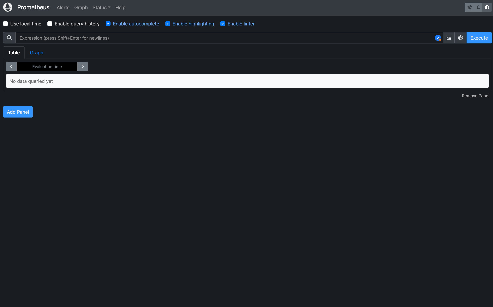
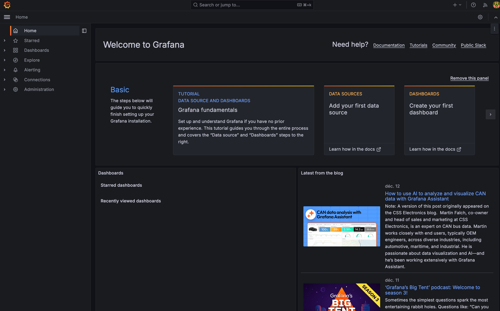
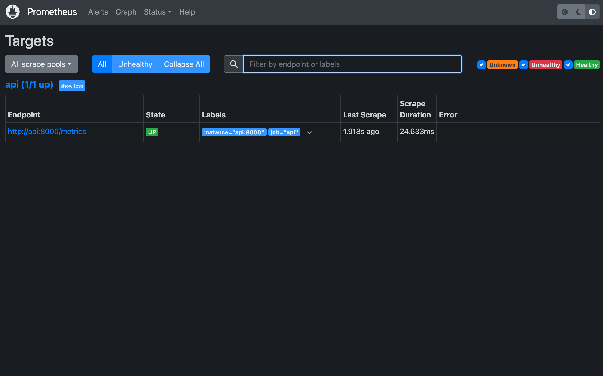
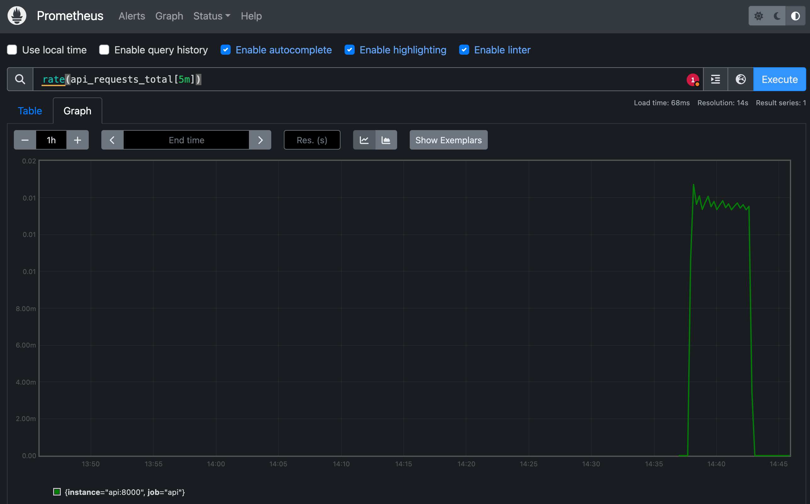
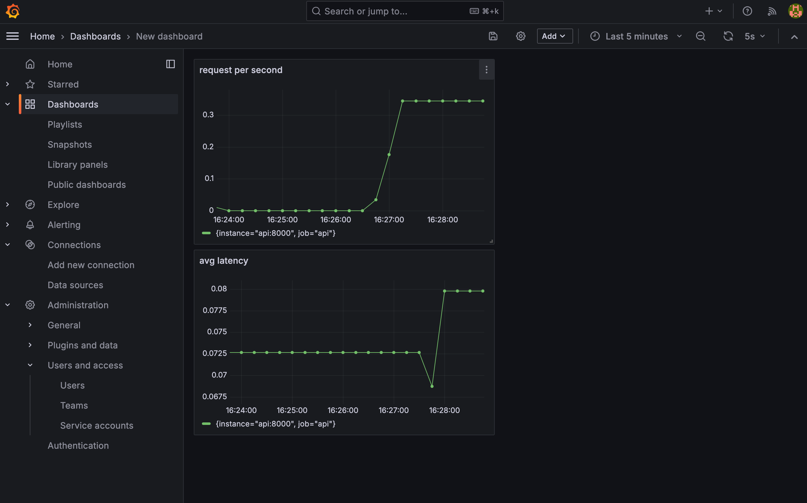
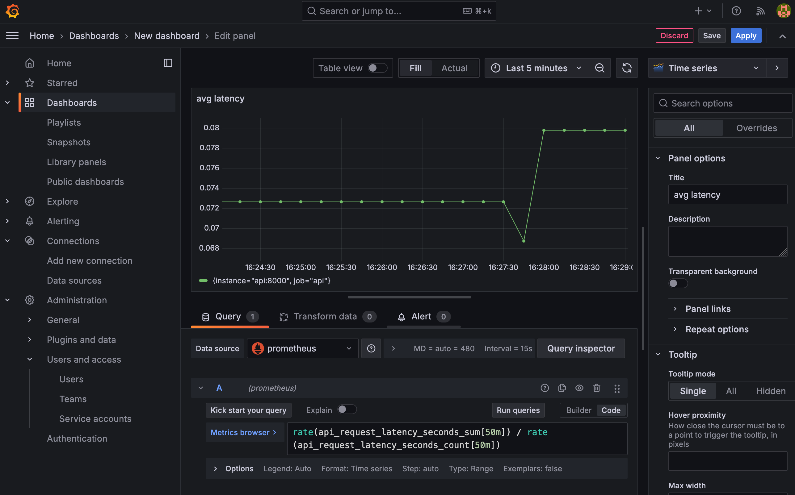
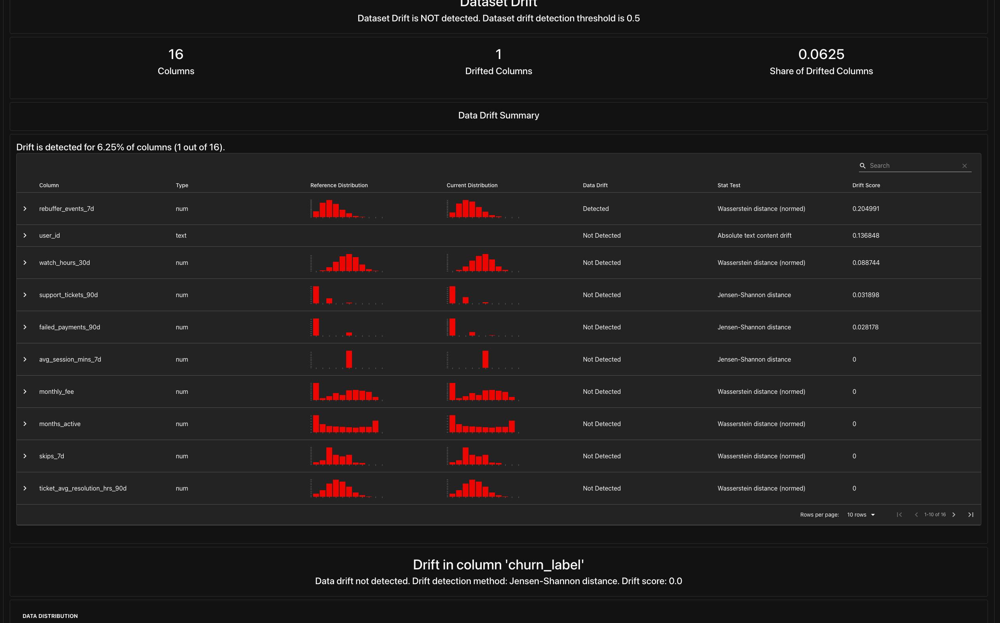

# TP5 : Monitoring et Observabilité

## Exercice 1 

### Démarrage et vérification des services
J'ai ajouté Prometheus et Grafana au `docker-compose.yml` et créé l'arborescence de provisioning.

**Pourquoi "api:8000" ?**

Prometheus utilise l'adresse api:8000 car au sein du réseau Docker Compose, la résolution DNS se fait par nom de service. localhost désignerait le conteneur Prometheus lui-même, alors que api pointe vers l'adresse IP interne du conteneur de l'API.

**Transcript terminal:**

```terminaloutput
(.venv) (base) aramsis@mac csc8613-tp1 % docker compose up -d
[+] Running 24/24
 ✔ prometheus Pulled                                                                                                                                                    41.6s 
 ✔ grafana Pulled                                                                                                                                                       36.5s 
[+] Running 8/8
 ✔ Volume "csc8613-tp1_grafana-data"  Created                                                                                                                            0.0s 
 ✔ Container csc8613-tp1-mlflow-1     Running                                                                                                                            0.0s 
 ✔ Container csc8613-tp1-postgres-1   Running                                                                                                                            0.0s 
 ✔ Container csc8613-tp1-feast-1      Running                                                                                                                            0.0s 
 ✔ Container csc8613-tp1-api-1        Running                                                                                                                            0.0s 
 ✔ Container streamflow-prometheus    Started                                                                                                                            1.3s 
 ✔ Container csc8613-tp1-prefect-1    Started                                                                                                                            1.4s 
 ✔ Container streamflow-grafana       Started                                                                                                                            1.1s 
```
```terminaloutput
(.venv) (base) aramsis@mac csc8613-tp1 % docker compose ps
NAME                     IMAGE                           COMMAND                  SERVICE      CREATED         STATUS         PORTS
csc8613-tp1-prefect-1    csc8613-tp1-prefect             "/usr/bin/tini -g --…"   prefect      3 seconds ago   Up 2 seconds   
streamflow-grafana       grafana/grafana:11.2.0          "/run.sh"                grafana      3 seconds ago   Up 2 seconds   0.0.0.0:3000->3000/tcp, [::]:3000->3000/tcp
streamflow-prometheus    prom/prometheus:v2.55.1         "/bin/prometheus --c…"   prometheus   3 seconds ago   Up 2 seconds   0.0.0.0:9090->9090/tcp, [::]:9090->9090/tcp
```


### Accès aux interfaces

**Prometheus** (localhost/9090):


**Grafana** (localhost/3000): 


---

## Exercice 2

**Extrait de `/metrics`** : 

```terminaloutput
(.venv) (base) aramsis@mac csc8613-tp1 % curl http://localhost:8000/metrics
# HELP python_gc_objects_collected_total Objects collected during gc
# TYPE python_gc_objects_collected_total counter
python_gc_objects_collected_total{generation="0"} 6885.0
python_gc_objects_collected_total{generation="1"} 4551.0
python_gc_objects_collected_total{generation="2"} 354.0
# HELP python_gc_objects_uncollectable_total Uncollectable objects found during GC
# TYPE python_gc_objects_uncollectable_total counter
python_gc_objects_uncollectable_total{generation="0"} 0.0
python_gc_objects_uncollectable_total{generation="1"} 0.0
python_gc_objects_uncollectable_total{generation="2"} 0.0
# HELP python_gc_collections_total Number of times this generation was collected
# TYPE python_gc_collections_total counter
python_gc_collections_total{generation="0"} 1446.0
python_gc_collections_total{generation="1"} 131.0
python_gc_collections_total{generation="2"} 11.0
...
# TYPE process_open_fds gauge
process_open_fds 16.0
# HELP process_max_fds Maximum number of open file descriptors.
# TYPE process_max_fds gauge
process_max_fds 1.048576e+06
# HELP feast_feature_server_cpu_usage CPU usage of the Feast feature server
# TYPE feast_feature_server_cpu_usage gauge
feast_feature_server_cpu_usage 0.0
# HELP feast_feature_server_memory_usage Memory usage of the Feast feature server
# TYPE feast_feature_server_memory_usage gauge
feast_feature_server_memory_usage 0.0
...
api_request_latency_seconds_bucket{le="0.075"} 3.0
api_request_latency_seconds_bucket{le="0.1"} 3.0
api_request_latency_seconds_bucket{le="0.25"} 4.0
api_request_latency_seconds_bucket{le="0.5"} 4.0
api_request_latency_seconds_bucket{le="0.75"} 4.0
api_request_latency_seconds_bucket{le="1.0"} 4.0
api_request_latency_seconds_bucket{le="2.5"} 4.0
api_request_latency_seconds_bucket{le="5.0"} 4.0
api_request_latency_seconds_bucket{le="7.5"} 4.0
api_request_latency_seconds_bucket{le="10.0"} 4.0
api_request_latency_seconds_bucket{le="+Inf"} 4.0
api_request_latency_seconds_count 4.0
api_request_latency_seconds_sum 0.26925158500671387
# HELP api_request_latency_seconds_created Latency of API requests in seconds
# TYPE api_request_latency_seconds_created gauge
api_request_latency_seconds_created 1.767969394091881e+09
```

**Pourquoi un histogramme ?**

Un histogramme est bien plus utile qu'une simple moyenne pour mesurer la latence car la moyenne masque les extrêmes. 
Dans un système distribué, ce qui compte souvent, c'est la "tail latency" (les requêtes les plus lentes, p95 ou p99). 
L'histogramme permet de voir si 95% des utilisateurs ont une réponse rapide, même si quelques requêtes très lentes font monter la moyenne arithmétique.

## Exercice 3

### Question 3.a
La cible de l'API est bien détectée par Prometheus et son état est **UP**, ce qui signifie que le scraping fonctionne correctement.



### Question 3.b
J'ai exécuté les requêtes suivantes dans l'onglet Graph :

* **`up`** :
    * **Résultat :** Renvoie la valeur `1`.
    * **Interprétation :** Indique que l'instance est en ligne et accessible. Si la valeur était `0`, le service serait considéré comme down.

* **`api_requests_total`** :
    * **Résultat :** Un nombre entier qui ne fait qu'augmenter (ex: 50, 51, 52...).
    * **Interprétation :** C'est un compteur monotone. Il représente le nombre cumulé total de requêtes reçues par l'API depuis son dernier démarrage.

* **`rate(api_requests_total[5m])`** :
    * **Résultat :** Une courbe ou une valeur flottante.
    * **Interprétation :** Cette fonction calcule la dérivée du compteur. Elle donne le **nombre de requêtes par seconde (RPS)** moyen sur une fenêtre glissante de 5 minutes. C'est la métrique de charge instantanée.



### Question 3.c 
J'ai exécuté la requête complexe suivante pour estimer la latence :

```promql
rate(api_request_latency_seconds_sum[5m]) / rate(api_request_latency_seconds_count[5m])
```
**Signification** : Cette formule représente le temps de réponse moyen d'une requête sur les 5 dernières minutes, obtenu en divisant la somme totale du temps passé par le nombre total de requêtes sur cette période.

# Exercice 4

## Dashboard grafana


## Editeur de requete latence 


Ces métriques permettent de détecter des **problèmes d'infrastructure ou d'application** : une surcharge serveur, un bug introduisant une boucle infinie, ou une panne complète avec 0 RPS.
Cependant, elles sont **aveugles à la qualité du modèle**. L'API peut répondre très vite, tout en renvoyant des prédictions aberrantes ou biaisées. Pour détecter cela, on surveiller le **drift** des données ou les performances métier.


## Exercice 5 

J'ai exécuté le flux de monitoring comparant le mois de référence (`2024-01-31`) au mois courant (`2024-02-29`) avec la commande suivante :

```bash
docker compose exec -e REPORT_DIR=/reports/evidently prefect \
  python /opt/prefect/flows/monitor_flow.py
```

### Drift summary
Voici un aperçu du "Data Drift Summary" généré :




### Covariate Drift vs Target Drift

Dans le contexte de ce projet :

- **Covariate Drift :** Désigne un changement dans la distribution des features d'entrée. Par exemple, si les utilisateurs commencent soudainement à consommer beaucoup plus de vidéos le week-end qu'auparavant. Le modèle reçoit des données qui ne ressemblent plus à celles de l'entraînement.
- **Target Drift :** Désigne un changement dans la distribution de la variable cible, ici le `churn_label`. Par exemple, si le taux de désabonnement passe brutalement de 5% à 20%. C'est souvent utilisé comme un indicateur indirect d'une baisse de performance du modèle lorsque la vérité terrain n'est pas disponible immédiatement.

### 4. Décision Automatisée

Suite à l'analyse, le script a pris la décision suivante (basée sur le `drift_share` calculé) :

```terminaloutput
[Evidently] report_html=/reports/evidently/drift_2024-01-31_vs_2024-02-29.html report_json=/reports/evidently/drift_2024-01-31_vs_2024-02-29.json drift_share=0.06 -> NO_ACTION drift_share=0.06 < 0.30 (target_drift=0.0)
```