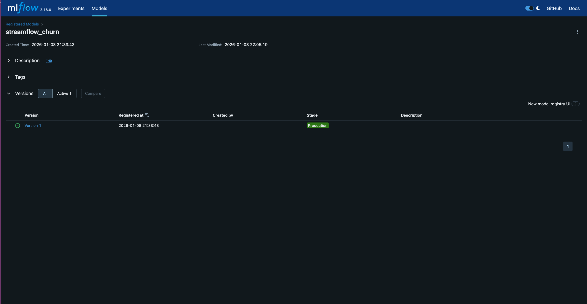
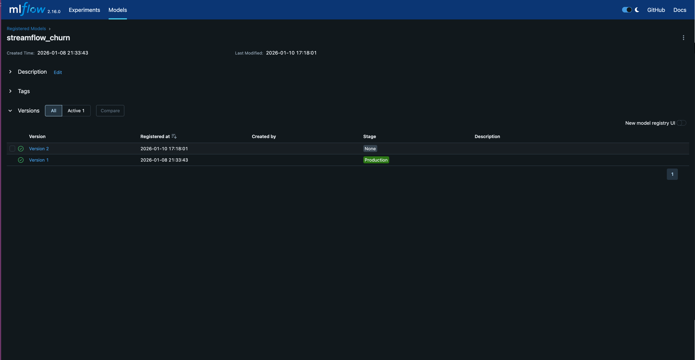
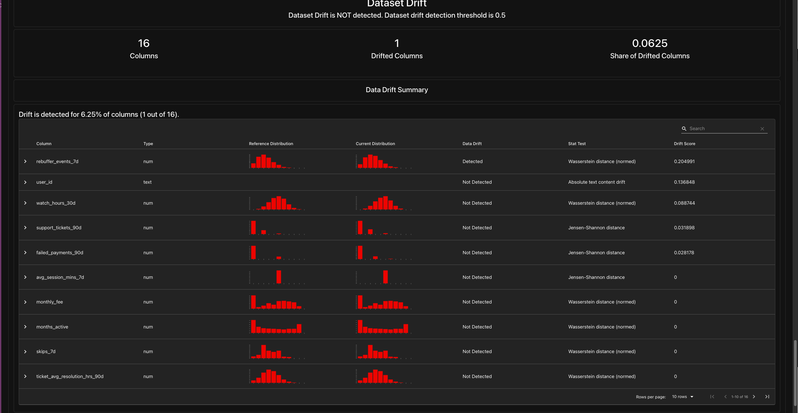

# TP6 : CI/CD pour systèmes ML + réentraînement automatisé + promotion MLflow

## Exercice 1 

Transcript terminal `docker compose up -d`:

```terminaloutput
(.venv) (base) aramsis@mac csc8613-tp1 % docker compose up -d
[+] Running 7/7
 ✔ Container csc8613-tp1-mlflow-1    Running                                                                                                                             0.0s 
 ✔ Container csc8613-tp1-postgres-1  Running                                                                                                                             0.0s 
 ✔ Container csc8613-tp1-feast-1     Running                                                                                                                             0.0s 
 ✔ Container csc8613-tp1-prefect-1   Running                                                                                                                             0.0s 
 ✔ Container csc8613-tp1-api-1       Running                                                                                                                             0.0s 
 ✔ Container streamflow-prometheus   Running                                                                                                                             0.0s 
 ✔ Container streamflow-grafana      Running                                                                                                                             0.0s 
```

Transcript terminal `docker compose ps` :

```terminaloutput
(.venv) (base) aramsis@mac csc8613-tp1 % docker compose ps
NAME                     IMAGE                           COMMAND                  SERVICE      CREATED        STATUS          PORTS
csc8613-tp1-api-1        csc8613-tp1-api                 "uvicorn app:app --h…"   api          26 hours ago   Up 13 seconds   0.0.0.0:8000->8000/tcp, [::]:8000->8000/tcp
csc8613-tp1-feast-1      csc8613-tp1-feast               "bash -lc 'tail -f /…"   feast        26 hours ago   Up 6 seconds    
csc8613-tp1-mlflow-1     ghcr.io/mlflow/mlflow:v2.16.0   "mlflow server --bac…"   mlflow       45 hours ago   Up 6 seconds    0.0.0.0:5000->5000/tcp, [::]:5000->5000/tcp
csc8613-tp1-postgres-1   postgres:16                     "docker-entrypoint.s…"   postgres     43 hours ago   Up 15 seconds   0.0.0.0:5432->5432/tcp, [::]:5432->5432/tcp
csc8613-tp1-prefect-1    csc8613-tp1-prefect             "/usr/bin/tini -g --…"   prefect      26 hours ago   Up 15 seconds   
streamflow-grafana       grafana/grafana:11.2.0          "/run.sh"                grafana      26 hours ago   Up 15 seconds   0.0.0.0:3000->3000/tcp, [::]:3000->3000/tcp
streamflow-prometheus    prom/prometheus:v2.55.1         "/bin/prometheus --c…"   prometheus   26 hours ago   Up 15 seconds   0.0.0.0:9090->9090/tcp, [::]:9090->9090/tcp
```

Capture d'écran MLFlow avec version Production :



## Exercice 2 

Trasncript terminal montrant succès `pytest -q`:
```terminaloutput
(.venv) (base) aramsis@mac csc8613-tp1 % pytest -q
..                                                                                                                                                                     [100%]
2 passed in 0.01s
```
**Pourquoi extraire une fonction pure ?**

On extrait la logique should_promote dans une fonction pure pour pouvoir la tester unitairement sans dépendre de l'infrastructure externe. Si la logique était enfouie au milieu du code Prefect ou MLflow, il faudrait mocker la base de données ou le registre de modèles juste pour vérifier une simple comparaison mathématique, ce qui rendrait les tests lents et fragiles.


## Exercice 3 

J'ai exécuté le flow de réentraînement et de comparaison. Le script a entraîné une nouvelle version, l'a comparée à la version en production (v1), et a décidé de **ne pas promouvoir** le modèle car la performance s'est dégradée.

**Logs d'exécution :**
```terminaloutput
[COMPARE] candidate_auc=0.6394 vs prod_auc=0.9452 (delta=0.0100)
[DECISION] skipped
[SUMMARY] as_of=2024-02-29 cand_v=2 cand_auc=0.6394 prod_v=1 prod_auc=0.9452 -> skipped
```

Comme le montre la capture ci-dessous, la Version 2 a bien été créée mais est restée au stage None, tandis que la Version 1 est restée en Production.



**Pourquoi utiliser un delta ?**

On utilise un paramètre `delta` pour garantir la stabilité du système : 
on ne remplace le modèle en production que si le candidat apporte une amélioration significative (au moins +1% ici). Cela évite les déploiements inutiles pour des gains marginaux.


## Exerice 4 

Le monitoring a détecté un drift de **6.25%** (`drift_share=0.06`), ce qui est supérieur au seuil de déclenchement configuré à **0.02**. Le système a donc automatiquement lancé le workflow de réentraînement (`train_and_compare`).

Après entraînement, le nouveau modèle (v3) s'est avéré moins performant que la production, la promotion a donc été annulée (`skipped`).

**Extrait des logs :**
```terminaloutput
[MONITOR] Drift detected (0.06 >= 0.02). Triggering retraining...
...
[COMPARE] candidate_auc=0.6394 vs prod_auc=0.9452 (delta=0.0100)
[DECISION] skipped
...
[Evidently] ... -> RETRAINING_TRIGGERED drift_share=0.06 >= 0.02 -> skipped
```

Le rapport montre que la colonne `rebuffer_events_7d a dérivé significativement, contribuant au score de drift global.



## Exercice 5 

Après redémarrage de l'API, le service est opérationnel et répond aux prédictions :

```bash
(.venv) (base) aramsis@mac csc8613-tp1 % curl -s -X POST "http://localhost:8000/predict" \
  -H "Content-Type: application/json" \
  -d '{"user_id":"5575-GNVDE"}' | jq
```
```json
{
  "user_id": "5575-GNVDE",
  "prediction": 0,
  "features_used": {
    "net_service": "DSL",
    "paperless_billing": false,
    "plan_stream_tv": false,
    "monthly_fee": 56.95000076293945,
    "months_active": 34,
    "plan_stream_movies": false,
    "unique_devices_30d": 1,
    "skips_7d": 6,
    "watch_hours_30d": 30.03622817993164,
    "rebuffer_events_7d": 4,
    "avg_session_mins_7d": 29.14104461669922,
    "failed_payments_90d": 0,
    "ticket_avg_resolution_hrs_90d": 8.600000381469727,
    "support_tickets_90d": 0
  }
}
```

**Pourquoi redémarrer l'API ?**

L'API charge le modèle en mémoire via `mlflow.pyfunc.load_model` uniquement au démarrage de l'application. 
Elle ne surveille pas le model registry en temps réel. 
Par conséquent, pour qu'elle prenne en compte une nouvelle version promue en "Production", il faut redémarrer le conteneur ou le processus Python.

## Exercice 6 

Capture de github action avec succès : 

